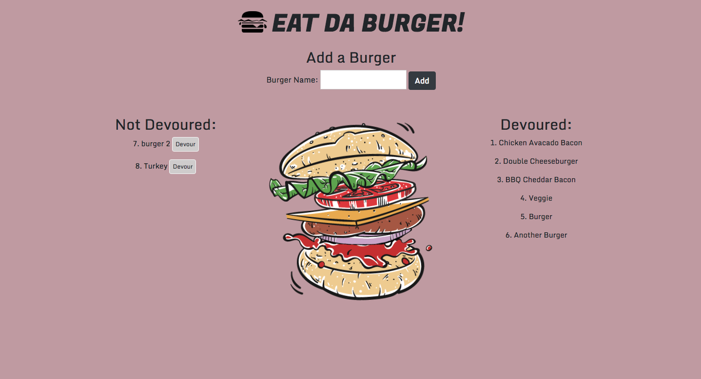

## Burger
Eat Da Burger is an application that uses Node.js, Express, and MySQL. The user is able to add burgers to the page through a form. The user can also 'devour' a burger by clicking on the devour button. That burger will then move to the devoured list of burgers.

______________
______________
______________
## Visit the deployed version of Nomad-Travelr
[Burger](https://shrouded-escarpment-96861.herokuapp.com/)



______________
______________
______________

## Getting Started
to install locally run this command in your terminal
```
git clone https://github.com/oserenchenko/burger.git
```
once inside the burger folder, run 
```
npm install
```
then, start the server by running 
```
node server.js
```
finally, open your prefferred browser and go to
```
localhost:8080
```

## Built With
* HTML - website structure
* [CSS](https://css-tricks.com/) - styling
* [Bootstrap](https://getbootstrap.com/) - styling framework
* [Javascript](https://www.javascript.com/) - website logic
* [jQuery](https://jquery.com/) - manipulating the DOM
* [MySQL](https://www.mysql.com/) - database
* [Node.js](https://nodejs.org/en/) - JS runtime
* [Express](https://expressjs.com/) - web framework for Node.js
* [Handlebars](https://handlebarsjs.com/) - JS templates

______________
______________
______________
## Authors
* [Olga Serenchenko](https://github.com/oserenchenko)

______________
______________
______________
## License
This project is licensed under the MIT License - see the [LICENSE.md](LICENSE.md) file for details
